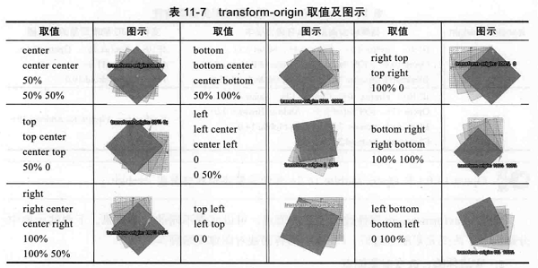

#### 5、2D变换
CSS3 的 transform 属性允许我们移动、旋转、缩放和倾斜元素,可同时对一个元素进行变形的多种属性操作，在多个变形函数使用时需要用空格隔开。。它的基本语法是： <br>
```CSS
E { transform: none|function(value); }    
```
先上一张图，系统地介绍一下transform属性的可选值： <br>

##### 旋转
在上面的所有这些函数中，rotate可能就是最简单的函数了，它会让元素围绕一个固定的点进行旋转，允许负值，元素将逆时针旋转。 <br>
文档一旦经过变换，看起来就像把position:relative应用到它上面一样，也就是说该元素相当于两个元素一样。原始的、转换前的元素会保持在文档流中的位置，所以后续的所有元素都会受到它以及它的margin和padding的影响。经过变换后的元素并不影响页面的布局，但它会位于页面剩余部分之上的一个新层中，意味着这个新的元素可以覆盖后续的元素。
```HTML
<div>你好。这是一个 div 元素。</div>
<div id="div2">你好。这是一个 div 元素。</div>
```
```css
div#div2
{
transform:rotate(30deg);         /* 值 rotate(30deg) 把元素顺时针旋转 30 度 */
-ms-transform:rotate(30deg); /* IE 9 */
-moz-transform:rotate(30deg); /* Firefox */
-webkit-transform:rotate(30deg); /* Safari and Chrome */
-o-transform:rotate(30deg); /* Opera */
}
```
###### transform-origin
该属性用来指定元素的中心点位置，默认变形原点在元素中心，即X轴和Y轴的50%处。  <br>

##### 平移
控制平移的函数是 translate()，该函数将元素从它的默认位置进行平移。在 2D 变换模块它包含了下列两个独立函数：
```CSS
E { transform: translate(X, Y); }         
```
此属性可以实现垂直水平居中：
```CSS
.center {
        position: absolute;
        top: 50%;
        left: 50%;
        -webkit-transform: translate(-50%,-50%);
        -ms-transform: translate(-50%,-50%);
        -moz-transform: translate(-50%,-50%);
        -o-transform: translate(-50%,-50%);
        transform: translate(-50%,-50%); 
    }
```
	translate() 函数的表现颇像相对定位 position: relative; 中的 left top 属性，但是二者还是有区别的，经过变换的元素会保留它的位置，只是从显示上看起来向被移动过，被变换的是元素的图像，而不是元素本身。 <br>
##### 倾斜
通过 skew() 方法，元素翻转给定的角度，根据给定的水平线（X 轴）和垂直线（Y 轴）参数：
```HTML
<div>你好。这是一个 div 元素。</div>
<div id="div2">你好。这是一个 div 元素。</div>
```
```css
div
{
width:100px;
height:75px;
background-color:yellow;
border:1px solid black;
}
div#div2
{
transform:skew(30deg,20deg);       /* 值 skew(30deg,20deg) 围绕 X 轴把元素翻转 30 度，围绕 Y 轴翻转 20 度 */
-ms-transform:skew(30deg,20deg); /* IE 9 */
-moz-transform:skew(30deg,20deg); /* Firefox */
-webkit-transform:skew(30deg,20deg); /* Safari and Chrome */
-o-transform:skew(30deg,20deg); /* Opera */
}
```
skew() 函数使用的是角度值，也可以使用负值，而函数的简写形式可以使用一个或两个值。如果使用一个值，第二个值 skewY 会默认为 0。 <br>
如果是沿着 x轴 倾斜，那么就是元素的水平边依然保持水平，而竖直边则按照度数倾斜旋转；如果是沿着 y轴 倾斜，那么就是元素的竖直边依然保持竖直状态，但是水平边则按照度数倾斜旋转。
##### 缩放
通过 scale() 方法，元素的尺寸会增加或减少，根据给定的宽度（X 轴）和高度（Y 轴）参数：
```css
div
{
width:100px;
height:75px;
background-color:yellow;
border:1px solid black;
}
div#div2
{
margin:100px;
transform:scale(2,4);               /* 值 scale(2,4) 把宽度转换为原始尺寸的 2 倍，把高度转换为原始高度的 4 倍 */
-ms-transform:scale(2,4); /* IE 9 */
-moz-transform:scale(2,4); /* Firefox */
-webkit-transform:scale(2,4); /* Safari and Chrome */
-o-transform:scale(2,4); /* Opera */
}
```
scale()还可以使用负值，使用负值的效果就是垂直的翻转元素，创建原来元素的映射。
###### 多重变换
把transform属性中用空格隔开列出多个函数，就可以在一个单独的元素上应用多重变换。
```CSS
h2{ transform : rotate(-40deg) scale(0.75) translate(-46%,-400%); }  /* 旋转、缩放并平移一个元素 */
```
###### 使用矩阵变换元素
matrix() 方法把所有 2D 转换方法组合在一起。matrix() 方法需要六个参数，包含数学函数，允许您：旋转、缩放、移动以及倾斜元素。
```css
div{           /* 将 div 元素旋转 30 度 */
transform:matrix(0.866,0.5,-0.5,0.866,0,0);
-ms-transform:matrix(0.866,0.5,-0.5,0.866,0,0); /* IE 9 */
-moz-transform:matrix(0.866,0.5,-0.5,0.866,0,0); /* Firefox */
-webkit-transform:matrix(0.866,0.5,-0.5,0.866,0,0); /* Safari and Chrome */
-o-transform:matrix(0.866,0.5,-0.5,0.866,0,0); /* Opera */
}
```
更深入具体介绍matrix()方法可以 [点击这里](http://www.zhangxinxu.com/wordpress/?p=2427)
####### 使用webkit反射
“Web2.0”的一种常见的设计手法就是反射的图片——即让一张图片看上去似乎在光滑的表面上出现了反射。 <br>
CSS3中的-webkit-box-reflect即可实现这一效果，语法为：
```css
E{ -webkit-box-reflect:direction offset mask-box-image; }
/* 
	direction:方位,可以是下面4个值中的1个，above,below,left,right，分别表示上下左右。如果不是使用类似inherit等全局关键字，则此方位值是不能缺省的。
	offset:偏移大小，倒影和原始元素偏移距离。可以是数值，也可以是百分比值。如果是百分比值，则百分比大小是相对于元素自身尺寸计算的。和transform中translate的百分比计算是一致的。
	mask-box-image:对元素倒影的遮罩控制。语法类似于background-image。
*/
```
更深入具体介绍-webkit-box-reflect()方法可以 [点击这里](http://www.zhangxinxu.com/wordpress/?p=5599) <br>
也有另一种参数写法：
```css
E:{ -webkit-box-reflect:direction offset source slice repeat; } 
/* 就像border-image，source是图片文件url，slice是可选的一系列长度值，用于定义图片要使用的区域。 */
```
例子：
```css
/* 使用透明到白色的渐变垂直地填充，产生了一种光滑的反射效果 */
h2.transform-1{ -webkit-box-reflect:below 0 -webkit-gradient(linear,50%,0,50%,100%,from(transparent),to(white)); }
/* 使用图片clound.png在反射上产生遮罩的作用 */
h2.transform-2{ -webkit-box-reflect:url('clound.png'); }
```
注意：反射和其他变换效果行为是一样的：它并没有占据页面布局流的位置，而是位于主体内容之上的层，因此会覆盖在后面的元素上。


#### 6、3D变换
CSS3 3D并非我们所想的3D效果，其实CSS3 3D就是纯粹利用计算的方法，基于浏览器的高效能，在2D的空间上制作一个3D的圆形，就像我们在一张纸上画一个立方体之类的，因为3D效果借助了浏览器来运算，所以自然而然地非常耗性能，往往只要有过多的形状转换来为3D呈现，所以如果有过多的3D呈现的话，就会发现电脑会开始疯狂地运转，所以3D效果还是要慎用的。 <br>
  <br>
####### transform-style
首先认识一下transform-style，如果不改变transform-style的默认值，就无法再三维变换中观察到我们所做的变换。其值可以设为flat（默认）——子元素将不保留其 3D 位置；或者preserve-3d——子元素将保留其 3D 位置。 <br>
transform-style指定的值会影响元素的子元素，而不是元素本身。本质上，它的作用就是设置子元素究竟是在分离的平面中显示还是全部被收缩到一起。 <br>
但是如果一个元素的overflow值为hidden，它的子元素就无法以3d显示，所以元素看上去就像是transform-style值被设置为flat一样。
```CSS
#div3{
padding:40px;
position: absolute;
border: 1px solid black;         
background-color: yellow;
transform: rotateY(80deg);     /* 值为flat，所以三维变换只会应用到二维平面上，虽然扭曲了元素，但是并没有产生深度的真实感觉 */  
-webkit-transform: rotateY(-60deg); /* Safari and Chrome */
}
#div2{
padding:50px;
position: absolute;
border: 1px solid black;
background-color: red;
transform: rotateY(60deg);
transform-style: preserve-3d;       /* 值为preserve-3d，它在三维中变换元素，并产生了真实的深度感 */
-webkit-transform: rotateY(60deg); /* Safari and Chrome */
-webkit-transform-style: preserve-3d; /* Safari and Chrome */
}
```

##### 变换函数
###### 绕轴旋转
2D里面旋转只有一条旋转所围绕的轴，所以rotate只需要一个单独的值。但是3D旋转中，有3条轴可以围绕旋转，所以就需要3个属性进行控制。 <br>
```css
E {
	transform:rotateX(angle);transform:rotateY(angle);transform:rotateZ(angle);
	/* 也可以合起来写成一行代码 */
	transform:rotateX(angle) rotateY(angle) rotateZ(angle);
	/* 也可以用rotated函数 */
	transform:rotate3d(x,y,z,angle); /* angle为角度值，x，y，z为数字值，用于计算方向向量 */
}
```
rotate3d()可详见 [这里](https://developer.mozilla.org/en-US/docs/Web/CSS/transform-function/rotate3d)
###### 沿轴平移
在2D中我们已经试过将元素沿着X轴和Y轴移动——translateX和translateY函数，三维中就是添加一个translateZ函数: <br>
```css
E{ transform:translateZ( 30px ); }   /* 沿着z轴把div移动30px */
```
现在有一个新的简写函数translate3d，能够设置全部的三个值： <br>
```CSS
E { transform:translate3d(translateX,translateY,translateZ); }
```
###### 缩放
与二维的scale函数一样，三维里增加了scaleZ子函数：
```css
E{ transform:scaleZ(number); }    /* number值提供了元素的缩放因子，但因为元素本身没有深度，只有高度和宽度，所以在scaleZ中增加数值看上去对元素并没有改变，所增加的数值实际上起的作用就像提供给translateZ值的乘数，如下所示： */
E{ transform:scaleZ(3) translateZ(10px); } /* scaleZ函数的值3会乘以translateZ函数的值10px，所以该元素将会显示在z轴上30px的位置 */
```
同样地，新的简写函数scale3d能够设置三个值.。
###### 变换矩阵
2D变换矩阵比较难懂的就是matrix函数了，它允许设置六个值（基于网络状排列）和一些三角几何计算去应用复杂的变换。 <br>
对应地3d中存在matrix3d函数，可以设置16个值： <br>
```css
E{ transform:matrix3d(a1, b1, c1, d1, a2, b2, c2, d2, a3, b3, c3, d3, a4, b4, c4, d4); }
```
这个函数非常强大——也非常复杂。。。
###### 透视
CSS 3D提供了一个全新的函数——perspective。perspective 属性定义 3D 元素距视图的距离，以像素计。该属性允许您改变 3D 元素查看 3D 元素的视图。 <br>
当为元素定义 perspective 属性时，其子元素会获得透视效果，而不是元素本身。 <br>
```CSS
#div1{
position: relative;
height: 150px;
width: 150px;
margin: 50px;
padding:10px;
border: 1px solid black;
perspective:150;          /* 设置元素被查看位置的视图 */
-webkit-perspective:150; /* Safari and Chrome */
}
#div2{
padding:50px;
position: absolute;
border: 1px solid black;
background-color: yellow;
transform: rotateX(45deg);
-webkit-transform: rotateX(45deg); /* Safari and Chrome */
}
```
perspective属性需要和perspective-origin 属性搭配使用，perspective-origin 属性定义 3D 元素所基于的 X 轴和 Y 轴。该属性允许您改变 3D 元素的底部位置。当为元素定义 perspective-origin 属性时，其子元素会获得透视效果，而不是元素本身。
###### 显示或隐藏背面
元素旋转的时候，一旦元素的正面远离我们的时候，我们会看到元素的背面。默认情况下，元素似乎就像透明一样，使所以实际上我们看到正面所显示内容的反转图像。CSS3提供了backface-visibility属性来改变这一情况。 <br>
如果在旋转元素不希望看到其背面时，该属性很有用。 <br>
```css
div{
position:relative;
height:60px;
width:60px;
border:1px solid #000;
background-color:yellow;
transform:rotateY(180deg);
-webkit-transform:rotateY(180deg); /* Chrome and Safari */
-moz-transform:rotateY(180deg); /* Firefox */
}
#div1{
-webkit-backface-visibility:hidden;      /* 元素的 backface-visibility 属性设置为 "hidden"，所以应该是不可见的 */
-moz-backface-visibility:hidden;
-ms-backface-visibility:hidden;
}
#div2{
-webkit-backface-visibility:visible;
-moz-backface-visibility:visible;
-ms-backface-visibility:visible;
}
```


<br>
更多关于2D/3D变换可以参考：
[漫谈CSS transform动画技术](http://www.webhek.com/css-animation-using-css-transforms)  <br>
[CSS3 3D transform变换](http://www.zhangxinxu.com/wordpress/?p=2592)   <br>
[CSS3 变换](https://segmentfault.com/a/1190000003986706)


